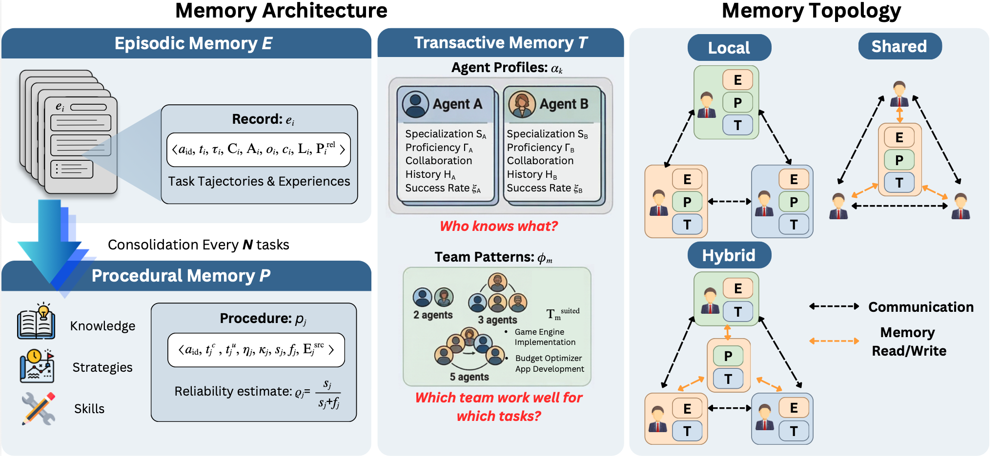
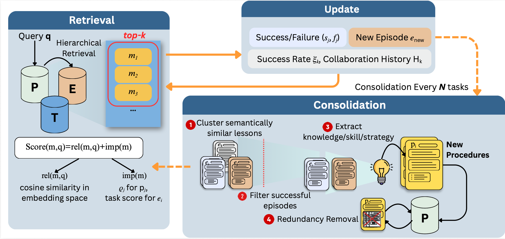

<div align="center">

# LLMA-Mem

### Lifelong Multi-Agent Memory for Persistent Coordination, Retrieval, and Learning

<p>
  A focused Python package for <strong>episodic</strong>, <strong>procedural</strong>, and <strong>transactive</strong> memory in multi-agent systems.
</p>

<p>
  <a href="#overview">Overview</a> •
  <a href="#architecture">Architecture</a> •
  <a href="#lifecycle">Lifecycle</a> •
  <a href="#installation">Installation</a> •
  <a href="#quickstart">Quickstart</a> •
  <a href="#usage">Usage</a> •
  <a href="#testing">Testing</a>
</p>

</div>

---

## Overview

LLMA-Mem gives multi-agent workflows a memory system that persists across tasks and runs.

Instead of treating each task as isolated, LLMA-Mem keeps track of:

- what happened before
- which strategies worked
- which agents are good at what

At the package level, the system is built around three memory layers:

| Memory Layer | Role |
| --- | --- |
| `EpisodicMemory` | Records task-level experiences, actions, outcomes, and lessons |
| `ProceduralMemory` | Stores distilled reusable strategies extracted from past episodes |
| `TransactiveMemory` | Tracks agent capabilities, team composition, and collaboration patterns |

Primary entrypoint:

```python
from llmamem.memory import LLMAMem
```

---

## Architecture

<div align="center">
  
</div>

<p align="center">
  <em>LLMA-Mem supports local, shared, and hybrid memory topologies for multi-agent coordination.</em>
</p>

---

## Lifecycle

<div align="center">
  
</div>

<p align="center">
  <em>The lifecycle moves through task context setup, retrieval, action recording, post-task updates, and consolidation.</em>
</p>

---


## Installation

Set up a standard Python environment:

```bash
python3 -m venv .venv
source .venv/bin/activate
python -m pip install -U pip
python -m pip install -e .
```

If you want real provider-backed LLM and embedding calls, install the optional dependencies too:

```bash
python -m pip install -r requirements.txt
```

---

## Quickstart

Run the local demo:

```bash
python3 examples/llma_mem_quickstart.py
```

The demo is plug and play.

---

## Usage

### Recommended flow

1. Create one `LLMAMem` instance per agent, or use `LLMAMem.create_for_topology(...)`.
2. Choose a topology: `local`, `shared`, or `hybrid`.
3. Call `set_task_context(...)` before each task.
4. Record actions with `record_action(...)` or `update(...)`.
5. Retrieve prompt-ready context with `get_memory_str()`.
6. Finalize the task with `update_after_task(...)`.
7. Reuse the same `persist_dir` across runs to preserve memory.

### Minimal example

```python
from llmamem.memory import LLMAMem

team = LLMAMem.create_for_topology(
    topology="shared",
    agent_ids=["planner", "analyst"],
    persist_dir="memory_store/my_run",
    consolidation_interval=5,
)

planner = team["planner"]
planner.set_task_context("Diagnose the API timeout regression.")
planner.record_action(
    {"tool": "inspect_logs", "result": "Timeouts started after cache rollout."}
)

planner.update_after_task(
    task_description="Diagnose the API timeout regression.",
    team_composition=["planner", "analyst"],
    outcome={"success": True, "metrics": {"performance": 0.9}},
    context="Cache invalidation caused a miss-rate spike.",
    task_type="incident-response",
)
```

### Supported topologies

| Topology | Behavior |
| --- | --- |
| `local` | Each agent keeps private episodic, procedural, and transactive memory |
| `shared` | All agents use the same shared memory stores |
| `hybrid` | Local episodic memory with shared higher-level memory structures |

---

## Testing

Run the built-in tests with standard Python tooling:

```bash
python3 -m unittest discover -s tests -p 'test_*.py'
```

Current coverage includes:

- shared-topology initialization
- episode persistence
- transactive-memory updates
- procedural-memory retrieval priority
